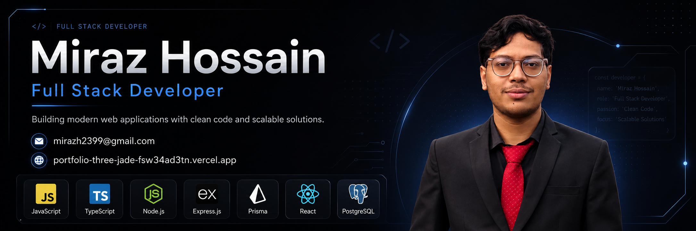

  

<h1 align="center">Hi, I'm Miraz Hossain 👋</h1>

<h3 align="center">Full Stack Developer | Backend-Focused</h3>

  I develop modern full-stack web applications with a strong focus on backend development,
  API design, database management, and clean, maintainable code.

 

## 👨‍💻 About Me

- 👋 I’m **Miraz Hossain**, a Full Stack Developer with a strong interest in backend development.
- 🚀 I’m currently exploring **Next.js** while building a full-stack blog application.
- 🛠️ I work with **JavaScript, TypeScript, React, Node.js, Express.js, Prisma, and PostgreSQL**.
- ⚙️ I enjoy building **REST APIs, database-driven applications, authentication systems, and structured backend solutions**.
- 🌱 I’m focused on improving my skills through real-world projects and consistent practice.
- 🌐 View my work on my [Portfolio](https://portfolio-three-jade-fsw34ad3tn.vercel.app/).
- 📫 Reach me at **[mirazh2399@gmail.com](mailto:mirazh2399@gmail.com)**.

 

## 🛠️ Tech Stack

### Languages

  

### Frontend

  

### Backend & Database

  

### Tools

  

